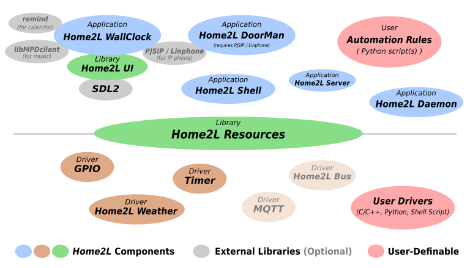

What are the *Home2Ls*?
=======================

The *Home2L `[houmtu:l]`* suite is a framework, library and set of tools for automation in private smart homes. Its main features and design goals are:

## Efficient and Lightweight Design

All core components are written in C/C++, with a very minimum set of external dependencies beyond *libc* - ideally suited for small embedded devices and microcontrollers. There is no need for a Java runtime environment or a heavy web framework. Starting up a server and a command shell and shutting both down again takes less than a second altogether - on an ARM-based minicomputer running at 144 MHz!

## Ambient Intelligence, No Need for a Central Server

Central servers are single points of failure. *Home2L* follows a completely distributed concept. Any (mini-)computer can act as part of the network. If resources, such as sensors or actors, are connected to them, they can be exported to any other host in the *Home2L* network. A failure of a host only causes its own resources to be unavailable - everything else keeps on working.

## Automation Rules Written in Python - But not Limited to That

There is no new language or tool to learn to formulate automation rules. *Home2L* rules are typically formulated in Python, they profit from the simplicity and power of the Python language. There can be multiple rules scripts, they may run on any machine, and they may be combined with other software routines or be part of a larger application.

Other ways to interact with *Home2L* resources is via the C/C++ API from any application or by shell scripts using the *Home2L Shell* in non-interactive mode.

## Easy Driver Development in C/C++, Python or Any Other Language

An API for *resource* drivers allows to easily add support for new hardware. A driver can be implemented

- in native C/C++ code,
- as a shell script,
- in Python.

For all three cases, documented examples are available in the source tree.

## Privacy

The *Home2Ls* do not need any Internet connection and do not try to communicate with hosts other than they are configured to. By design, the *Home2Ls* communicate with each other over a (trusted) LAN, which can easily be set up and secured using standard Linux/UNIX techniques. The open source licensing ensures transparency for what the software does inside the user's private home.

## Modularity

The core part, the *Resources* library, is kept small and portable with APIs for application programs *and* drivers in C/C++ and Python. All other components are optional and can be used or replaced by alternatives as desired by the user.

*Home2L* Components
===================

## Versatile *Resources* Library

The central component of the *Home2L* suite is the *Resources* library. It manages physical sensors and actors, software services, computers and more. Everything that can act or sense in the widest sense, can be modelled as a *resources* in the *Home2L* suite.

All *resources* are arranged in a common namespace, but driven and accessed in a completely distribited way from any computer. They can be manipulated or read out using the library, which provides full network transparency and supports arbitrary concurrent accesses from any process on any machine anytime.

Drivers for *resources* can be written in C, C++, Python, as a shell script, or in any language as a standalone program.

Both automation rules and resource drivers can also be part of a larger program. Any software linking against the *Resources* library can access resources or publish own run-time information as resources.

The *Home2L Shell* allows to access resources and submit requests on the command line or by shell scripts.

**Event-driven communication** allows fast responses to action requests and sensor value changes while keeping the network traffic and thus power consumption low. The library is designed to be precise. As an extreme example: If some hardware switch is not properly debounced, every *Home2L* instance in the network is able to capture each individual bounce.

**Proper handling of concurrency:** The user pushes a button to open the window shades. One second later, a timer-triggered automatic rule tells the shades to close. What should happen now? *Home2L* implements a novel **request resolution mechanism** to deal with this or other kinds of concurrency.

## Smart Wall Clocks for Your Home

The *Home2L WallClock* is a lightweight, unobtrusive user interface including a VoIP video phone, a calendar applet and an MPD music player frontend.

It is written in native code (C++) and only uses *SDL2* for its UI toolkit. This makes it very portable and lightweight. Low-cost, low-performance minicomputers or Android tablets can be used as end-user devices, there is no need to install and regularly update a full-featured web browser on them.

## Door Phone Application

*DoorMan* is VoIP-based video doorbell and doorphone tool using *Linphone* or (in the future) *PJSIP* as its backend.

Live Demonstration and Further Information
==========================================

More information on the *Home2L* suite can be found in the [*Home2L Book*](home2l-book.pdf). The book includes **a step-by-step tutorial on setting up a virtual home in a virtual machine demonstrating some key features of the *Home2L* suite**.

The APIs for developing rules and drivers or to extend the *Home2Ls* are documented with Doxygen ( [C/C++](home2l-api_c/index.html), [Python](home2l-api_python/index.html) ).

Help Needed!
============

Until now, the *Home2L*  project has been developed by a single private person in his spare time. The code has been published with the hope that is useful to the community.

To let the project grow further and make available to a broader audience, **volunteers are welcome**.

Great contributions for the community would be, for example:

- Make **sample installations** and document them.

- **Packaging**: Create packages for major Linux distributions.

- **Documentation**: Write good documentation, particularly for end users.

- **Drivers:** Implement drivers for any hardware you like or have.
  Help with an *MQTT* bridge would be appreciated, too.

- **Bridges to other home automation frameworks:** Implement drivers to interface
  with other open home automation frameworks.

- **Report and help fixing bugs.**

- **Translations** and internationalization.

- Write an **HTML frontend**.

For any questions on how to participate, do not hesitate to contact the author via the project page.

