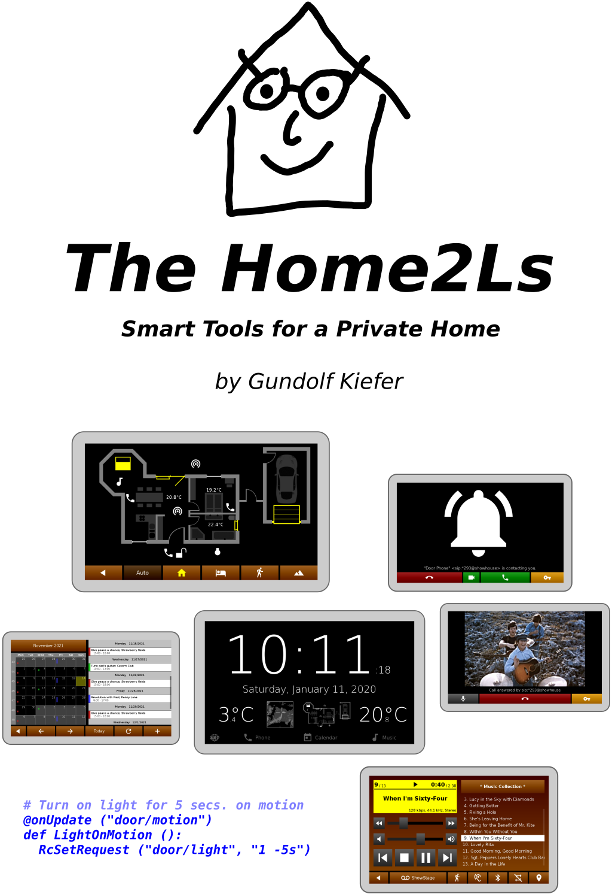

What are the *Home2Ls*?
=======================

The *Home2L `[houmtu:l]`* suite is a collection of tools and libraries for automation in private homes. Its main features are:

* **_Home2L Resources_**: Novel concept to integrate and manage sensors, actors or services of any kind **efficiently and precisely**.

* **Automation rules written in Python** - but not limited to that.

* **Easy integration of services and new devices** - via MQTT, in C/C++, Python or by a shell script.

* **_Home2L Brownies_**: Simple and efficient **automation bus to interconnect cheap 8-bit microcontrollers**
  for do-it-yourself sensor or actor hardware.

* **_Home2L WallClock_**: **Lightweight, concise, and responsive information display**,
  suitable to be installed on cheap tablets or minicomputers and mounted in all rooms - just like a wall clock.

* **Interactive floor plan** for all kinds of gadgets (windows, shades, lights, phones, computers, services, ...).

* **Video door phone** and **inter-room communication** (SIP-based).

* **Playing music** anywhere at home (MPD-based).

* **Family calendar** (in *WallClock*).

* **Docker image** and improved tutorial for getting started quickly.

What is New?
============

* Adaptations for building on **Debian 11 (Bullseye)**

* Several improvements and cleanups in the **Resources** library:
    - Support for MQTT-like and shell-like wildcards ('+', '#', '*', '?')
    - Default URI prefix is now always */alias*, allowing for smaller scripts
    - New event type *rceRequestChanged* and improved API for querying requests
    - Shell improvements

* Updated **Tutorial**

* Several minor improvements and fixes

How Can I Try It? Get More Information?
=======================================

The main place of documentation is the [*Home2L Book*](home2l-book.pdf).
The APIs for developing rules and drivers or to extend the *Home2Ls* are documented with Doxygen:
[C/C++ API](home2l-api_c/index.html), [Python API](home2l-api_python/index.html).

The suite comes with a [Docker Demo Image](https://hub.docker.com/r/gkiefer/home2l) allowing to test the suite easily.
The [*Home2L Book*](home2l-book.pdf) contains a **a step-by-step tutorial demonstrating the key features of the *Home2L* suite**.

**For the brave and the impatient:**

    $ xhost +local:  # allow X11 applications to open windows
    $ docker run -ti --rm \
      --name home2l-showcase --hostname home2l-showcase \
      -e DISPLAY=$DISPLAY -v /tmp/.X11-unix:/tmp/.X11-unix \
      --device /dev/snd \
      gkiefer/home2l

What is Special About the *Home2Ls*?
====================================

## Versatile *Resources* Library

The central component of the *Home2L* suite is the *Resources* library. It connects physical sensors and actors, software services, computers and more. Everything that can act or sense in the widest sense, can be modelled as a *resource* in the *Home2L* suite.

All *resources* are arranged in a common namespace, but driven and accessed in a completely distribited way from any computer. They can be manipulated or read out using the library, which provides full network transparency and supports arbitrary concurrent accesses from any process on any machine anytime.

Resources are manipulated by means of independent *requests* with individual attributes like priorities and time intervals. The user pushes a button to open the window blinds. One second later, a timer-triggered automatic rule tells the blinds to close. What should happen now? The *request* model allows to clearly specify priorities (e.g. user interaction in favor of automation rules) and to handle concurrency properly.

The *Home2L Shell* is a powerful administration tool and allows to access resources and submit requests on the command line or by shell scripts.

Both automation rules and resource drivers can also be part of a larger program. Any software linking against the *Resources* library can access resources or publish own run-time information as resources.

## Efficient and Lightweight Design

All core components are written in C/C++, with a very minimum set of external dependencies beyond *libc* - ideally suited for small embedded devices and microcontrollers. There is no need for a Java runtime environment or a heavy web framework. Starting up a server and a command shell and shutting both down again takes less than a second altogether - on an ARM-based minicomputer running at 144 MHz!

The *Home2L WallClock* is written in native code (C++) and only uses *SDL2* for its UI toolkit. This makes it very portable and lightweight. Low-cost, low-performance minicomputers or Android tablets can be used as end-user devices, there is no need to install and regularly update a full-featured web browser on them.

## Ambient Intelligence, No Need for a Central Server

Central servers are single points of failure. *Home2L* follows a completely distributed concept. Any (mini-)computer can act as part of the network. If resources, such as sensors or actors, are connected to them, they can be exported to any other host in the *Home2L* network. A failure of a host only causes its own resources to be unavailable - everything else keeps on working.

## Automation Rules Written in Python - But Not Limited to That

There is no new language or tool to learn to formulate automation rules. *Home2L* rules written in Python profit from the simplicity and power of the Python language. There can be multiple rules scripts, they can run on any machine, and they may be combined with other software routines or be part of larger applications.

Other ways to interact with *Home2L* resources is via the C/C++ API from any application or by shell scripts using the *Home2L Shell*.

## Integrating Sensors/Actor Hardware and Services: MQTT, Python, Shell Scripts, ...

MQTT-enabled devices can be imported directly using the MQTT gateway driver.

An API for *resource* drivers allows to easily add support for new hardware or services. A driver can be implemented

- in native C/C++ code,
- as a shell script,
- in Python.

For all three cases, documented examples are available in the source tree.

## Easy Integration of Do-It-Yourself Hardware

*Home2L Brownies* are programmed low-cost microcontrollers (*AVR ATtiny 84/85/861*) connected to a Linux host over 4-wire cables (e.g. KNX/EIB cables). The bus protocol is based on *i2c*, robust and allows to build very simple, self-made hardware nodes. Just an *ATtiny* device and two resistors are enough to build a sensor node! Additional circuitry such as crystal clock generators, transceivers or voltage regulators are not necessary.

*Home2L Brownies* can drive, for example, window/door/light sensors (GPIOs), temperature sensors, or window shades/actuators.

The *Home2L* suite includes a software stack for the Linux (host) and for the microcontroller (device) side. The protocol includes various mechanisms for error correction/avoidance, host notification, as well as a variety of maintenance tools for remote configuration, diagnosis, collection of statistics, remote software updates, and device resurrection for the case that a software update failed and the device is difficult to reach physically.

## Privacy

The *Home2Ls* do not need an Internet connection and do not try to communicate with hosts other than they are configured to. By design, the *Home2Ls* communicate with each other over a (trusted) LAN, which can easily be set up and secured using standard Linux/UNIX techniques. The open source licensing ensures transparency for what the software does inside the user's private home.

## Modularity

The core part, the *Resources* library, is kept small and portable with APIs for application programs *and* drivers in C/C++ and Python. All other components are optional and can be used or replaced by alternatives as desired by the user.

How can I Help?
===============

The code has been published with the hope that is useful to the community. To let the project grow further and make available to a broader audience, **volunteers and partners are welcome**.

Great contributions are:

- **Report and help fixing bugs.**

- Make **sample installations**, document them and share your experiences.

- **Packaging**: Create packages for major Linux distributions.

- **Documentation**: Write good documentation, particularly for end users.

For any questions on how to participate, do not hesitate to contact us directly.

Questions?
==========

Feel free to contact: Gundolf Kiefer `<gundolf.kiefer@web.de>`
